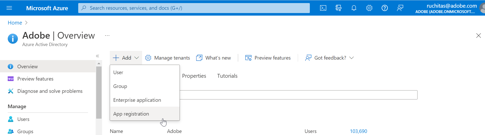
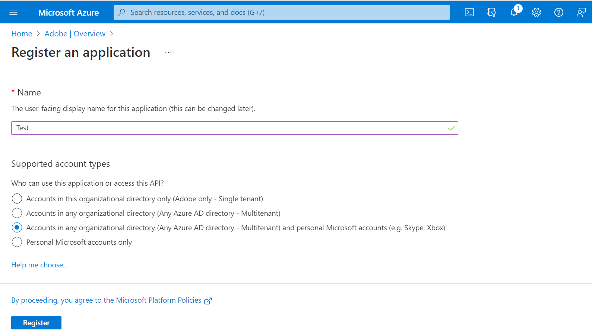
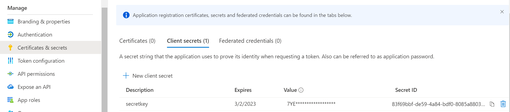
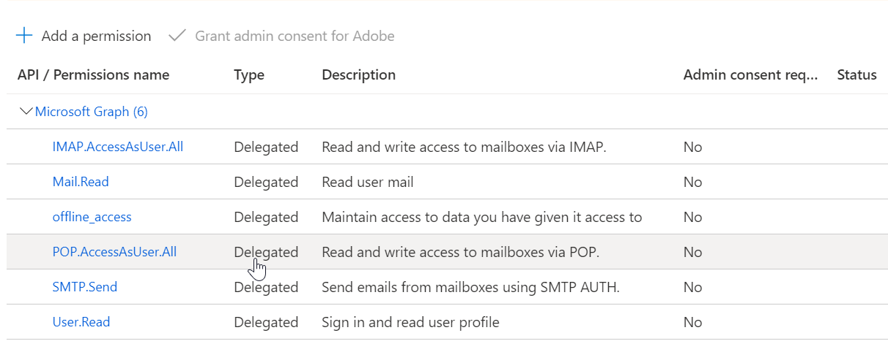
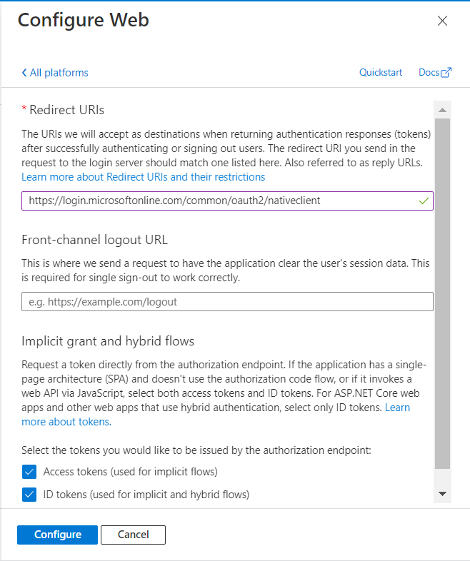
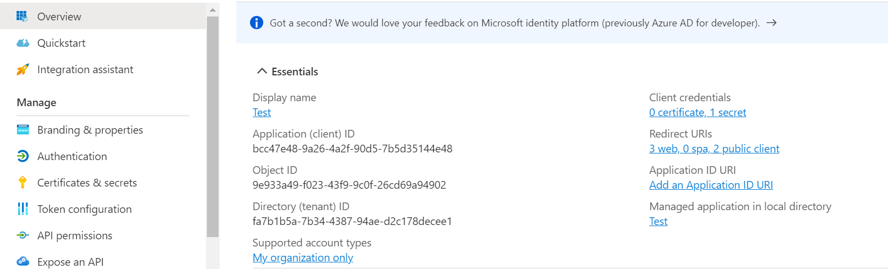
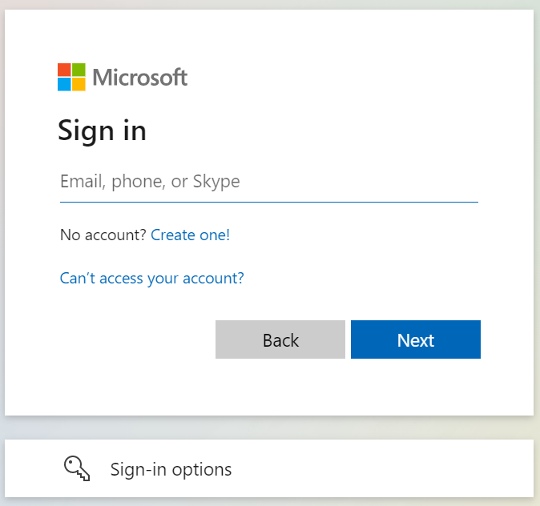
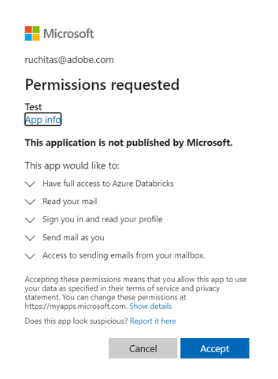

将 AEM Forms 与 Microsoft® Office 365 邮件服务器协议集成
=============================================

为了让组织遵守安全电子邮件要求，AEM Forms 提供了 OAuth 2.0 支持与 Microsoft® Office 365 邮件服务器协议集成。 您可以使用 Azure Active Directory (Azure AD) OAuth 2.0 身份验证服务连接各种协议（如 IMAP、POP 或 SMTP），并访问 Office 365 用户的电子邮件数据。 以下是配置 Microsoft® Office 365 邮件服务器协议以通过 OAuth 2.0 服务进行身份验证的分步说明：

1.  登录到 [https://portal.azure.com/](https://portal.azure.com/) 并在搜索栏中搜索​ **Azure Active Directory**，然后单击结果。  
    或者，您可以直接浏览到 [https://portal.azure.com/#blade/Microsoft_AAD_IAM/ActiveDirectoryMenuBlade/Overview](https://portal.azure.com/#blade/Microsoft_AAD_IAM/ActiveDirectoryMenuBlade/Overview)
    
2.  单击​ **添加** > **应用程序注册** > **新注册**。
    
      
    
3.  根据您的要求填写信息，然后单击 **注册。**  
        
    在上例中，已选择任何组织目录（任何 Azure AD 目录 — 多租户）中的 **帐户和个人 Microsoft® 帐户（例如，Skype、Xbox)** 选项。
    
    NOTE
    *   对于任何组织目录（任何 Azure AD 目录 — 多租户）**应用程序中的** ​帐户，Adobe 建议您使用工作帐户，而不是个人电子邮件帐户。
    *   **仅个人 Microsoft® 帐户** ​应用程序不受支持。
    *   Adobe 建议您使用​ **多租户和个人 Microsoft® 帐户** ​应用程序。
4.  接下来，转至​ **证书和密码**，单击​ **新建客户端密码**，然后执行屏幕上显示的步骤来创建密码。请务必记下此 secret 值供以后使用。
    
      
    
5.  若要添加权限，请转到新创建的应用程序，然后选择​ **API 权限** > **添加权限** > **Microsoft® Graph** > **委派权限**。
    
6.  选中应用程序的以下权限对应的复选框，然后单击​ **添加权限**：
    
    *   `IMAP.AccessUser.All`
    *   `Mail.Read`
    *   `offline_access`
    *   `POP.AccessAsUser.All`
    *   `SMTP.Send`
    *   `User.Read`
    
      
    
7.  选择​ **身份验证** > **添加平台** > **Web**，然后在​ **重定向 Url** ​部分中，添加以下任意 URI（通用资源标识符）作为：
    
    *   `https://login.microsoftonline.com/common/oauth2/nativeclient`
    *   `http://localhost`
    
    在这种情况下，`https://login.microsoftonline.com/common/oauth2/nativeclient`被用作重定向 URI。
    
8.  添加每个 URL 后单击 **配置**，并根据您的要求配置设置。  
      
    
    NOTE必须选中​ **访问令牌** ​和​ **ID 令牌** ​复选框。
9.  单击左侧窗格中的​ **概述**，并复制​ **应用程序（客户端） ID**、**目录（租户） ID** ​和​ **客户端密钥** ​的值供以后使用。
    
      
    

生成授权码
-----

接下来，必须生成授权码，如以下步骤所述：

1.  将`clientID`替换为`<client_id>`并在浏览器中打开以下 URL，将`redirect_uri`替换为您的应用程序的重定向 URI：
    
    `https://login.microsoftonline.com/common/oauth2/v2.0/authorize?client_id=[clientid]&scope=IMAP.AccessAsUser.All%20POP.AccessAsUser.All%20SMTP.Send%20User.Read%20Mail.Read%20offline_access&response_type=code&redirect_uri=[redirect_uri]&prompt=login`
    
    NOTE如果存在单个租户应用程序，请在以下 URL 中将`common`替换为您的`[tenantid]`以生成授权代码： `https://login.microsoftonline.com/[tenantid]/oauth2/v2.0/authorize?client_id=[[clientid]]&scope=IMAP.AccessAsUser.All%20POP.AccessAsUser.All%20SMTP.Send%20User.Read%20Mail.Read%20openid%20offline_access&response_type=code&redirect_uri=[redirect_uri]&prompt=login`
2.  键入上述 URL 后，您将被重定向到登录屏幕：  
      
    
3.  输入电子邮件，单击​ **下一步**，将显示 “应用程序权限” 屏幕：
    
      
    
4.  当您允许权限时，您将被重定向到一个新的 URL，如下所示： `https://login.microsoftonline.com/common/oauth2/nativeclient?code=<code>&session_state=[session_id]`
    
5.  将上述 URL 中`<code>`的值从`0.ASY...`复制到上述 URL 中的`&session_state`。
    

生成刷新令牌
------

接下来，必须生成刷新令牌，如以下步骤所述：

1.  打开命令提示符并使用以下 cURL 命令获取 refreshToken。
    
2.  将`clientID`、`client_secret`和`redirect_uri`替换为应用程序的值以及`<code>`的值：
    
    `curl -H "ContentType application/x-www-form-urlencoded" -d "client_id=[client-id]&scope=https%3A%2F%2Foutlook.office.com%2FIMAP.AccessAsUser.All%20https%3A%2F%2Foutlook.office.com%2FPOP.AccessAsUser.All%20https%3A%2F%2Foutlook.office.com%2FSMTP.Send%20https%3A%2F%2Foutlook.office.com%2FUser.Read%20https%3A%2F%2Foutlook.office.com%2FMail.Read%20offline_access&code=[code]&grant_type=authorization_code&redirect_uri=[redirect_uri]&client_secret=[secretkey_value]" -X POST https://login.microsoftonline.com/common/oauth2/v2.0/token`
    
    NOTE在单个租户应用程序中，要生成刷新令牌，请使用以下 cURL 命令并将`common`替换为中的`[tenantid]`：  
    `curl -H "ContentType application/x-www-form-urlencoded" -d "client_id=[client-id]&scope=https%3A%2F%2Foutlook.office.com%2FIMAP.AccessAsUser.All%20https%3A%2F%2Foutlook.office.com%2FPOP.AccessAsUser.All%20https%3A%2F%2Foutlook.office.com%2FSMTP.Send%20https%3A%2F%2Foutlook.office.com%2FUser.Read%20https%3A%2F%2Foutlook.office.com%2FMail.Read%20offline_access&code=[code]&grant_type=authorization_code&redirect_uri=[redirect_uri]&client_secret=[secretkey_value]" -X POST https://login.microsoftonline.com/[tenantid]/oauth2/v2.0/token`
3.  记下刷新令牌。
    
